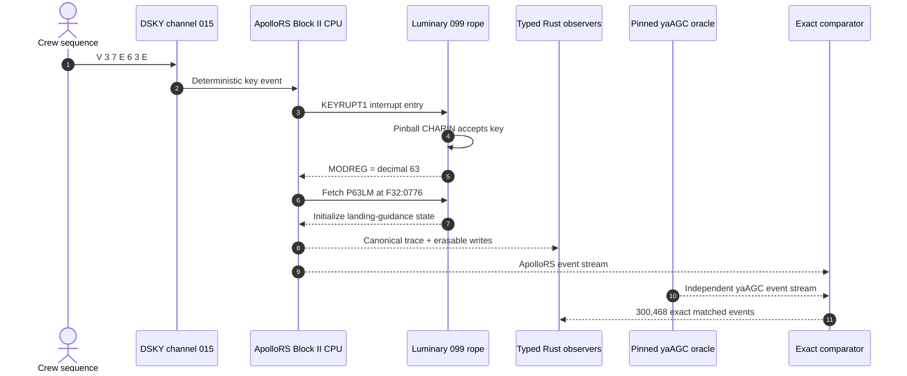
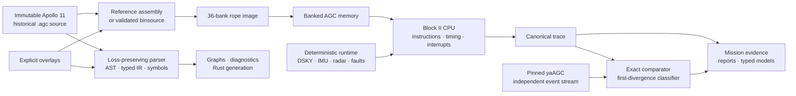

<div align="center">

# ApolloRS

### The Apollo 11 Guidance Computer, made executable, inspectable, and testable in Rust

[](rust-toolchain.toml)
[](Cargo.toml)
[](#verification)
[](#the-flagship-experiment)
[](#licensing-and-provenance)

**Real Luminary 099 rope · Real Block II execution · Real DSKY path · Exact yaAGC comparison**

</div>

```text
┌────────────────────── APOLLO RS / MISSION PROOF CONSOLE ──────────────────────┐
│ CREW INPUT     V37E63E                                                        │
│ SOFTWARE PATH  KEYRUPT1 ✓  CHARIN ✓  MODREG=63 ✓  P63LM F32:0776 ✓          │
│ GUIDANCE       WHICH ✓  DVTHRUSH ✓  DVCNTR ✓  WCHPHASE ✓  FLPASS0 ✓         │
│ ORACLE         300,468 / 300,468 ApolloRS events match pinned yaAGC ✓        │
│ INTEGRITY      175 historical .agc files verified byte-for-byte ✓             │
└────────────────────────────────────────────────────────────────────────────────┘
```

ApolloRS is an executable research system for the Apollo 11 Block II Apollo
Guidance Computer. It preserves the historical Comanche 055 and Luminary 099
source transcriptions byte-for-byte, loads real rope images, executes AGC words
through an original Rust machine model, drives the DSKY and deterministic
hardware inputs, and emits evidence that can be compared with an independent
yaAGC run.

This is not a themed simulator wrapped around scripted mission output. The
flagship result comes from the historical Luminary rope processing the actual
keyboard sequence, entering the original Pinball and landing-guidance code, and
mutating real AGC state.

> **Current claim:** ApolloRS proves a bounded Apollo 11 P63 selection, entry,
> and initialization slice. It does **not** claim a complete powered descent,
> touchdown, or high-level rewrite of all flight software.

## Mission status at a glance

| Measured property | Current result |
|---|---:|
| Rust workspace | 24 crates, `unsafe` forbidden |
| Historical corpus | 175 `.agc` files |
| Historical size | 3,150,815 bytes / 130,186 physical lines |
| Historical revision | `247dd7d0d1b0e7f9f270750ec08983e0a72e73e1` |
| Luminary mission run | 300,000 instructions / 504,958 machine cycles |
| ApolloRS architectural events | 300,468 |
| Exact yaAGC matches | 300,468, with no ApolloRS-stream divergence |
| DSKY acceptance | All seven `V37E63E` keys reached KEYRUPT1 and `CHARIN` |
| P63 checkpoint | `P63LM` at physical `F32:0776`, cycle 241,219 |
| Typed reconstructions | Pinball V37 state machine and P63 initialization |
| Fault experiment | First decode divergence at event 145,942; no bounded recovery |
| Test suite | 71 tests passing, plus clean Clippy and release build |

The yaAGC reference continues beyond the ApolloRS stream to 795,178 events.
The result is therefore an **exact qualified common-prefix match**, not a claim
that both executions were compared forever.

## Why ApolloRS exists

ApolloRS treats the Apollo source as something to execute and interrogate, not
merely display.

- **Preservation without mutation.** Historical `.agc` files are immutable
  inputs. Compatibility fixes live in explicit, reviewable overlays.
- **Machine semantics before translation.** One's-complement arithmetic,
  signed zero, bank switching, edit registers, interrupts, timers, channels,
  and instruction timing belong to typed Rust modules with tests.
- **Evidence before spectacle.** Mission claims require trace milestones,
  hashes, revisions, exact commands, and declared comparison fields.
- **Readable reconstruction without substitution.** Typed Rust models explain
  bounded routines while the original rope remains the execution authority.
- **Negative results are first-class.** Unsupported assembly forms, trace
  divergence, absent mission state, and unreached checkpoints are reported
  rather than hidden behind optimistic output.

## The flagship experiment

ApolloRS asks the real Luminary 099 rope to enter lunar-landing program 63 by
delivering the historical DSKY sequence `V37E63E`. Each key is software-paced:
the next key is withheld until the prior key has passed through KEYRUPT1 and
Pinball's `CHARIN` routine.



### Trace-backed checkpoints

| Checkpoint | Trace event | Instruction | Cycle | Physical location |
|---|---:|---:|---:|---|
| `MODREG=63` | 145,405 | 145,181 | 240,227 | `F02:1314` |
| `P63LM` | 145,942 | 145,716 | 241,219 | `F32:0776` |
| first `WHICH` write | 146,070 | 145,844 | 241,462 | `E7:0055` |
| first `DVTHRUSH` write | 146,072 | 145,846 | 241,466 | `E2:0251` |
| first `DVCNTR` write | 146,074 | 145,848 | 241,470 | `E7:0115` |
| first `WCHPHASE` write | 146,076 | 145,850 | 241,474 | `E2:0351` |
| first `FLPASS0` write | 146,078 | 145,852 | 241,478 | `E7:0223` |

The five initialization values are octal `02076`, `00044`, `00004`, `77776`
(-1 in one's complement), and positive zero. Their values and source order
match `P63Initialization::luminary099()`, the readable Rust reconstruction.
Later trace-backed writes include TPIP, LAND, TTF/8, VGU, and RGU state.

### What the independent comparator checks

Every ApolloRS event is compared with the separately instrumented yaAGC stream
on:

```text
event kind · normalized MCT cycle · PC · instruction · A · L · Q
EB · FB · BB · interrupt vector · interrupt number
```

The complete procedure, normalization rule, pinned revision, and minimal
instrumentation patch are in
[`docs/validation/yaagc-reference.md`](docs/validation/yaagc-reference.md).

## System architecture



The UI, reports, and readable models observe execution; they do not impersonate
Apollo software or schedule hidden flight-computer work. The detailed ownership
rules are documented in
[`docs/architecture/workspace.md`](docs/architecture/workspace.md).

## Implemented surface

| Layer | Crates | What is implemented |
|---|---|---|
| Exact values | `agc-word`, `agc-fixed` | 15-bit one's-complement words, signed zeros, end-around carry, double words, scaled integers |
| AGC machine | `agc-isa`, `agc-memory`, `agc-cpu` | Basic/extracode decoding, registers, banks, edit behavior, channels, timers, interrupts, instruction transitions |
| Runtime | `agc-runtime`, `agc-faults`, `agc-dsky`, `agc-mission` | Deterministic events, DSKY relays and keys, IMU/radar inputs, fault audit, mission checkpoints |
| Historical source | `agc-source`, `agc-ast`, `agc-parser`, `agc-overlay`, `agc-ir`, `agc-symbols` | Immutable corpus access, exact syntax, includes, explicit edits, typed records, symbols |
| Build and recovery | `agc-assembler`, `agc-loader`, `agc-xref`, `agc-transpiler` | Focused native assembly, strict reference integration, rope loading, graphs, compile-checked Rust dispatch |
| Research evidence | `agc-trace`, `agc-validation`, `agc-reports`, `apollors-cli` | Canonical events, divergence classification, yaAGC adapter, provenance envelopes, operator workflows |
| Bounded models | `agc-interpreter` plus mission/DSKY models | Exact integer experiments and readable Pinball/P63 reconstructions |

## Launch ApolloRS

### 1. Clone with the historical source

```sh
git clone --recurse-submodules https://github.com/simransummermalik/ApolloRS.git
cd ApolloRS
```

The pinned toolchain is declared in `rust-toolchain.toml`. With `rustup`
installed, Cargo selects Rust 1.97.0 automatically.

### 2. Qualify the workspace

```sh
cargo fmt --all -- --check
cargo clippy --workspace --all-targets -- -D warnings
cargo test --workspace
cargo build --workspace --release
```

### 3. Verify the untouched Apollo corpus

```sh
cargo run --release -p apollors-cli -- --repository . verify-source \
  --manifest artifacts/generated/source-manifest.json
```

Expected result:

```text
verified 175 historical .agc files at commit 247dd7d0d1b0e7f9f270750ec08983e0a72e73e1
```

### 4. Run the P63 mission slice

```sh
cargo run --release -p apollors-cli -- --repository . mission \
  --rope artifacts/generated/luminary099-reference.bin \
  --format yayul \
  --instructions 300000 \
  --output artifacts/generated/luminary099-p63-run.json \
  --trace /tmp/apollors-p63-trace.jsonl
```

Expected measured summary:

```text
mission apollo11-lm5-padload-p63-entry: 300000 instructions, 504958 cycles,
60 real-state frames, 0 faults
```

### 5. Sit at the DSKY

```sh
cargo run --release -p apollors-cli -- --repository . dsky \
  --rope artifacts/generated/luminary099-reference.bin \
  --format yayul \
  --quantum 20000
```

The terminal accepts `0`–`9`, `verb`, `noun`, `+`, `-`, `enter`, `clear`,
`keyrel`, `reset`, `pro`, `step`, `run N`, `status`, and `quit`. Display digits
and lamps are derived from AGC output-channel traffic.

## Deliberately break P63

The paired campaign runs identical nominal and faulted controllers, flips one
bit in the `P63LM` rope word immediately before fetch, and compares their full
traces and final recovery state.

```sh
cargo run --release -p apollors-cli -- --repository . fault-campaign \
  --rope artifacts/generated/luminary099-reference.bin \
  --format yayul \
  --at-instruction 145715 \
  --rope-fault 32:0776:00001 \
  --instructions 180000 \
  --output artifacts/generated/luminary099-p63-rope-fault.json
```

| Observation | Nominal | Faulted |
|---|:---:|:---:|
| Program 63 selected | yes | yes |
| `P63LM` location reached | yes | yes |
| P63 initialization matches rope | yes | no |
| Landing-guidance activity starts | yes | no |
| Register state recovered at horizon | — | no |

The first difference is trace event 145,942: raw instruction `05353` becomes
`05352`. This demonstrates deterministic injection, exact detection, and
bounded non-recovery. It is not a claim about real rope-memory failure rates.

## Command atlas

| Command | Purpose |
|---|---|
| `forensics` | Inventory historical source and regenerate include graphs and capability reports |
| `verify-source` | Compare every historical path, size, line count, and SHA-256 with the manifest |
| `parse` | Expand includes into typed, provenance-preserving IR |
| `overlay verify` | Validate explicit compatibility evidence against the pinned corpus |
| `assemble` | Use focused native assembly, pinned yaYUL, or checksum-validated binsource input |
| `execute` | Run a rope for an exact instruction count and optionally emit JSONL trace |
| `validate` | Compare two ApolloRS traces under the complete internal schema |
| `validate-reference` | Compare ApolloRS with the pinned yaAGC architectural TSV |
| `transpile` | Emit standalone compile-checkable Rust instruction dispatch with provenance |
| `mission` | Run the trace-gated Luminary P63 scenario |
| `fault-campaign` | Run paired nominal/faulted P63 executions and classify divergence/recovery |
| `dsky` | Open the interactive channel-driven terminal DSKY |
| `validate-artifact` | Check a report envelope's schema and required provenance |

See every option with:

```sh
cargo run --release -p apollors-cli -- --help
```

## Evidence you can inspect

| Artifact | What it proves |
|---|---|
| [`source-manifest.json`](artifacts/generated/source-manifest.json) | Byte-level inventory of all historical `.agc` inputs |
| [`luminary099-reference-build.json`](artifacts/generated/luminary099-reference-build.json) | Strict pinned-yaYUL build, diagnostics, size, and rope hash |
| [`comanche055-reference-build.json`](artifacts/generated/comanche055-reference-build.json) | Rust-parsed binsource and all 36 accepted bank checksums |
| [`luminary099-p63-run.json`](artifacts/generated/luminary099-p63-run.json) | Inputs, real-state frames, key acceptance, P63 milestones, and guidance writes |
| [`luminary099-p63-vs-yaagc.json`](artifacts/generated/luminary099-p63-vs-yaagc.json) | Twelve-field, 300,468-event exact common-prefix result |
| [`luminary099-p63-rope-fault.json`](artifacts/generated/luminary099-p63-rope-fault.json) | Paired fault audit, first divergence, and bounded recovery classification |
| [`luminary099-native-assembly-status.json`](artifacts/generated/luminary099-native-assembly-status.json) | Honest native-assembler gaps rather than a false rope |
| [`repository-inventory.json`](artifacts/generated/repository-inventory.json) | Computed project and historical-corpus measurements |

Every JSON research result uses a versioned envelope containing historical and
tool revisions, input hashes, a generation command, timestamp, and known
limitations. Rope binaries, DOT graphs, generated Rust, and large JSONL traces
receive adjacent provenance sidecars.

<details>
<summary><strong>Current immutable hashes</strong></summary>

| Input or output | SHA-256 |
|---|---|
| Luminary 099 yaYUL-order rope | `bf87398818b99446e300aa319c3e177e42131277f7e83822e8fa0db8ba3008b1` |
| Comanche 055 validated rope | `2ba31de9291cd10fb351a64d261bae8514a1cb75b4651bfa6a135dfa821a2d79` |
| ApolloRS P63 trace used for comparison | `4e7f0f29abf8d55a979e04faad8fb6454fa2f235d2e89c92e9c4693fc3604853` |
| yaAGC exact-reference trace | `6b429c0eee39ea2286910c974766d8555f283f873bef9c6d6c5f000604594e07` |

</details>

## Verification

ApolloRS uses several deliberately different forms of evidence:

1. **Finite-domain tests** exhaust every 15-bit word for raw-word round trips
   and decode every word in both basic and extracode contexts.
2. **Unit and property tests** cover arithmetic, signed zeros, memory aliases,
   edit registers, channels, interrupts, timers, parsing, overlays, loading,
   DSKY behavior, tracing, reports, and deterministic replay.
3. **Internal trace comparison** catches exact ApolloRS regressions and reports
   the first differing field.
4. **Independent yaAGC comparison** checks the flagship stream against a
   separately compiled implementation.
5. **Mission acceptance gates** require key handling, program selection,
   physical rope entry, source-ordered writes, and typed-model agreement.
6. **Artifact validation** rejects missing schema, revision, hash, command, or
   limitation metadata.

The complete claim table is
[`docs/validation/verification-matrix.md`](docs/validation/verification-matrix.md).

## Evidence vocabulary

ApolloRS keeps four ideas separate:

1. **Historical emulation** — original AGC words execute on the Rust machine.
2. **Mechanical translation** — source or IR becomes Rust without a readability
   or equivalence claim.
3. **Idiomatic reconstruction** — a bounded routine is expressed as normal,
   typed Rust.
4. **Behaviorally verified equivalence** — a named initial state, input stream,
   oracle, observable set, and finite interval agree.

Only the fourth is called equivalent, and only within its measured boundary.

## Honest boundaries

- ApolloRS executes the original rope; it is not a complete high-level rewrite
  of every Comanche or Luminary routine.
- The native parser is corpus-wide and loss-preserving, but the native assembler
  does not yet encode the complete yaYUL directive and interpretive dialect.
- Luminary uses strict pinned-yaYUL integration. Comanche uses the proofed
  VirtualAGC binsource only after Rust validates every bank checksum.
- Whole-program Rust generation is mechanical, provenance-preserving, and
  compile-checked, but currently marked unverified.
- The Apollo 11 LM-5 pad-load book excludes mission-time computed state vectors.
  The current fixture therefore cannot establish a physical descent trajectory.
- There is no continuous lunar-module vehicle, thrust, IMU, or landing-radar
  plant in the P63 experiment.
- `P63SPOT`, `P63SPOT2`, ignition, throttle profile, touchdown, and abort
  checkpoints are not reached or claimed.
- A matched common prefix is strong bounded evidence, not a formal proof of the
  entire emulator.

The precise vertical-slice definition is in
[`docs/validation/vertical-slice-dod.md`](docs/validation/vertical-slice-dod.md).

## Repository tour

```text
ApolloRS/
├── crates/                    24 focused Rust crates
│   ├── agc-word/              one's-complement words and signed zero
│   ├── agc-memory/            erasable/fixed banks, registers, channels
│   ├── agc-cpu/               Block II state transitions and timing
│   ├── agc-dsky/              keyboard encoding, relays, lamps, typed V37
│   ├── agc-mission/           P63 fixture, checkpoints, typed initialization
│   ├── agc-validation/        internal and yaAGC comparators
│   └── apollors-cli/          reproducible operator interface
├── historical/Apollo-11/     pinned, untouched historical submodule
├── overlays/                  explicit compatibility aliases and evidence
├── artifacts/generated/      compact reproducible proof artifacts
├── docs/                      architecture, ADRs, validation, originality
├── paper/README.md            measured research manuscript
└── Cargo.toml                 workspace and strict lint policy
```

## Documentation

- [Implementation status](docs/implementation-status.md)
- [Workspace architecture](docs/architecture/workspace.md)
- [Verification matrix](docs/validation/verification-matrix.md)
- [P63 vertical-slice definition](docs/validation/vertical-slice-dod.md)
- [Exact yaAGC reference procedure](docs/validation/yaagc-reference.md)
- [References, licenses, and originality](docs/research/reference-and-originality.md)
- [Architecture decisions](docs/adr/README.md)
- [Measured paper](paper/README.md)

## Road to a complete descent claim

A legitimate full-descent result requires more than running longer. It needs:

- a primary-source mission-time LM state vector and navigation history, or a
  qualified replay trace;
- a coupled vehicle, thrust, IMU, and landing-radar model with explicit units
  and timing;
- acceptance gates for `P63SPOT`, `P63SPOT2`, ignition, throttle transitions,
  alarms, abort paths, and touchdown;
- independent comparison of the additional machine and mission observables;
- uncertainty and trajectory-error reporting rather than cinematic output.

Until those exist, ApolloRS will keep the stronger, narrower claim it can
actually prove.

## Licensing and provenance

New ApolloRS Rust code is dual-licensed under
[`MIT`](LICENSE-MIT) or [`Apache-2.0`](LICENSE-APACHE). The historical Apollo
source submodule retains its upstream Public Domain Mark. VirtualAGC/yaAGC and
yaYUL remain external GPL-licensed reference tools; no VirtualAGC C source is
compiled into an ApolloRS crate. The exact instrumentation patch is kept at the
reference boundary with its applicable terms.

ApolloRS also documents the inspected `ragc` revision, external semantic
influence, adaptation boundary, and original work in
[`docs/research/reference-and-originality.md`](docs/research/reference-and-originality.md).

---

<div align="center">

**The achievement is not that Apollo software can be made to look modern.**

**It is that the original machine can be made observable without losing the
history, the arithmetic, or the evidence.**

</div>
