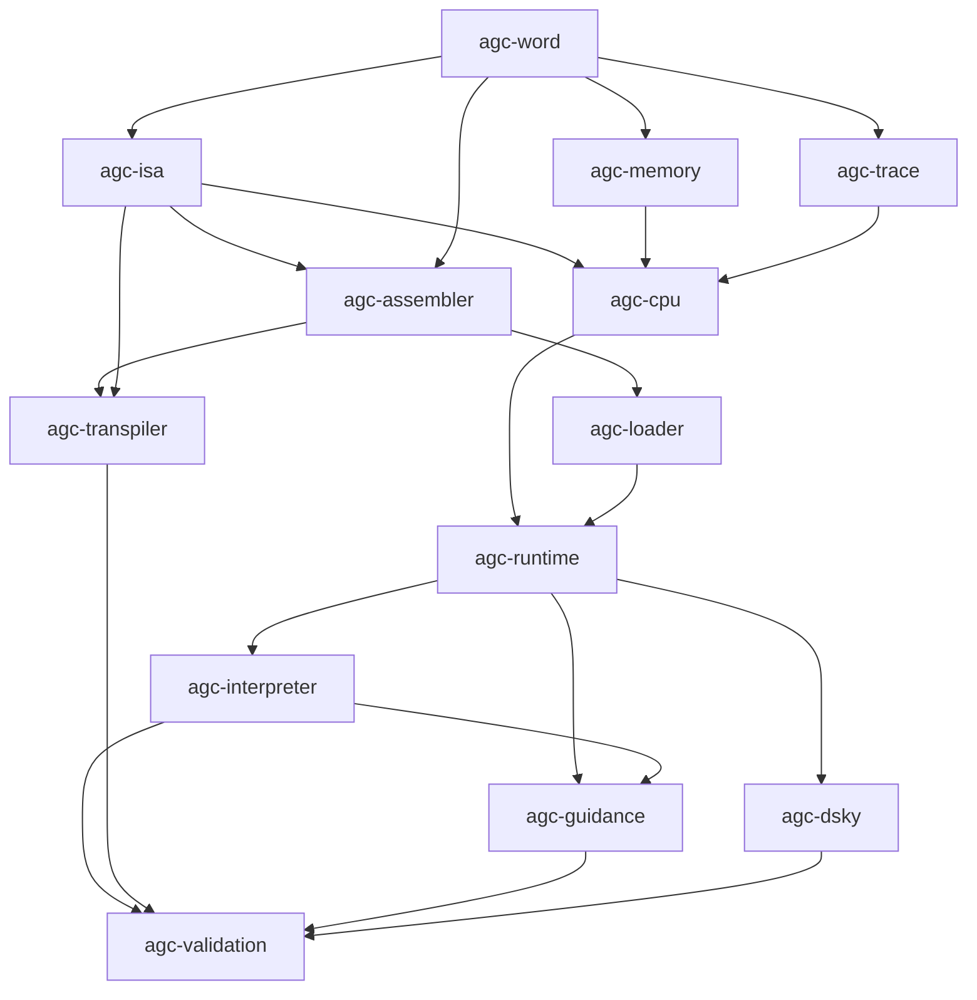

# Proposed Rust workspace

Status: proposed Phase 0 architecture.  Crates are intentionally not scaffolded
until the Phase 0 gate is accepted.

## Layout

```text
Apollo11/
├── Cargo.toml                     # workspace only, after Phase 0 acceptance
├── rust-toolchain.toml            # exact toolchain, after assumption A-011
├── crates/
│   ├── agc-word/                  # words, double words, fixed point
│   ├── agc-memory/                # registers and banked memory
│   ├── agc-isa/                   # instruction forms and decoded operations
│   ├── agc-cpu/                   # deterministic instruction-step semantics
│   ├── agc-assembler/             # source AST and yaYUL-compatible front end
│   ├── agc-loader/                # rope/listing/symbol artifact ingestion
│   ├── agc-trace/                 # versioned events, replay, comparison
│   ├── agc-runtime/               # clocks, interrupts, channels, peripherals
│   ├── agc-interpreter/           # AGC interpretive-language semantics
│   ├── agc-transpiler/            # typed IR and Rust back ends
│   ├── agc-guidance/              # selected reconstructed mission routines
│   ├── agc-dsky/                  # DSKY model and debugging presentation API
│   └── agc-validation/            # scenario fixtures and differential harness
├── tools/
│   └── forensics/                 # reproducible repository analysis
├── tests/
│   ├── instruction/
│   ├── arithmetic/
│   ├── differential/
│   ├── mission/
│   └── regression/
├── docs/
│   ├── architecture/
│   ├── research/
│   ├── semantics/
│   ├── validation/
│   └── adr/
├── examples/
├── artifacts/                     # versioned metadata; large blobs by policy
├── historical/                    # pinned, read-only source inputs
└── paper/                          # manuscript with measured-result placeholders
```

## Dependency direction



Arrows mean “is a lower-level dependency of.”  The intended consequences are:

- Numerical semantics do not depend on the CPU, scheduler, UI, or translator.
- Memory and instruction decoding can be tested independently.
- The CPU emits trace events through a narrow sink interface; trace collection
  may observe execution but cannot alter machine state.
- The runtime owns clocks, interrupts, channels, and peripheral coordination.
- The interpreter is software semantics above the basic-machine runtime, not a
  shortcut inside arithmetic or instruction decoding.
- The transpiler consumes typed, bank-aware source semantics.  It does not parse
  raw text directly in a code-generation pass.
- Validation is an outer-layer consumer and may depend on all implementations;
  production crates must not depend on it.

## Crate responsibilities and exclusions

| Crate | Owns | Must not own |
|---|---|---|
| `agc-word` | 15-bit one's-complement words, signed zero, DP representation, checked conversions, scale types | host-float approximations of AGC state |
| `agc-memory` | central registers, erasable/fixed banks, fixed-fixed mapping, edit-register behavior | instruction control flow |
| `agc-isa` | basic/extracode representation, decode tables, instruction metadata and cycle specification | mutable machine state |
| `agc-cpu` | one deterministic instruction transition and cycle accounting | mission scheduling policy or UI |
| `agc-assembler` | concrete syntax, typed AST, symbols, pseudo-ops, diagnostics, source provenance | silent ambiguity recovery |
| `agc-loader` | validated ingestion of assembled artifacts, symbols, and source maps | assembly semantics or translation |
| `agc-trace` | versioned event schema, canonical serialization, comparison, replay input records | state mutation |
| `agc-runtime` | clocks, interrupt arbitration, unprogrammed sequences, I/O channels, peripheral contracts | translated mission logic |
| `agc-interpreter` | interpretive order decode, MPAC/mode semantics, interpretive boundaries | replacements using ordinary host arithmetic |
| `agc-transpiler` | bank-aware IR, control/data-flow analyses, faithful and structured generation | equivalence claims |
| `agc-guidance` | explicitly bounded, provenance-bearing reconstructions | unverified whole-program rewrites |
| `agc-dsky` | DSKY state model and read-only debugging views | authoritative execution state outside runtime |
| `agc-validation` | fixtures, oracle adapters, trace alignment, divergence classification | production semantics used by both sides of a comparison |

Every crate starts with `#![forbid(unsafe_code)]`.  An exception requires a new
ADR, a safety argument, and tests that would fail if the assumed invariant is
violated.

## Build and feature policy

- Pin the Rust toolchain and dependency lockfile before the first executable
  artifact is called reproducible.
- Keep the semantic core free of UI and asynchronous-runtime dependencies.
- Use feature flags only for optional adapters, never to select different AGC
  semantics.
- Serialize octal machine quantities as raw bit patterns plus explicit type and
  scale metadata; human decimal renderings are secondary views.
- Keep generated Rust and generated traces out of source crates unless they are
  small, reviewed golden fixtures with recorded provenance.

## Workspace acceptance gate

Scaffolding may begin after the source baseline, research plan, risk register,
verification matrix, vertical-slice boundary, and ADR-0001 through ADR-0005 are
reviewed.  The first implementation crate is `agc-word`; assembler and
transpiler production work remains gated on tested word, memory, and CPU models.

