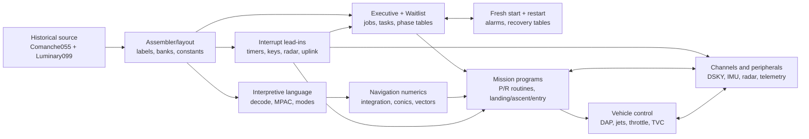

# Repository forensics plan and initial inventory

Status: Phase 0, lexical pass complete; assembler-backed and execution-backed
passes pending.

## Objective

Establish a reproducible map from immutable historical source bytes to the
modules, symbols, address assignments, subsystems, and execution entry points
that ApolloRS will model.  The result must be useful to researchers and machines
and must make uncertainty visible.

This report uses the source checkout at commit
`247dd7d0d1b0e7f9f270750ec08983e0a72e73e1`.  The inventory tool records SHA-256
for every `.agc` file.  No source file was changed.

## Forensic passes

### F0.1 — Acquisition and integrity

1. Record repository URL, branch, commit, license statement, and upstream
   attribution.
2. Require a clean historical checkout.
3. Hash every source file and preserve the manifest with derived artifacts.
4. Reject unrecorded source drift in all reproducible runs.
5. When the source baseline changes, compare source hashes, assembly output,
   symbol tables, and reference traces before accepting the revision.

Exit evidence: `source-manifest.sha256`, source metadata in
`repository-inventory.json`, and ADR-0001.

### F0.2 — Lexical repository inventory

1. Enumerate every `.agc` source module and physical line count.
2. Parse `$...` textual includes from each program's `MAIN.agc` in order.
3. Record exact include resolution and preserve unresolved tokens.
4. Compare module names and hashes across Comanche and Luminary.
5. Assign preliminary filename-based subsystem candidates.  These are triage
   hints only and require source review.

Exit evidence: JSON, CSV, DOT, and hash-manifest artifacts generated by
`tools/forensics/inventory.py`.

### F0.3 — Assembler-backed inventory

1. Pin a known yaYUL/Virtual AGC revision and its build environment.
2. Resolve source compatibility outside the historical tree through an explicit
   overlay manifest.
3. Reproduce Comanche 055 and Luminary 099 assembly.
4. Capture rope image, listing, symbol table, checksums, warnings, and complete
   command/environment metadata.
5. Parse symbol definitions, pseudo-ops, banks, address ranges, constants,
   erasable allocations, and duplicate or unresolved symbols.
6. Compare produced checksums with documented reference values, if a primary or
   trusted secondary source can be cited.

Exit criterion: two deterministic assembly bundles whose content hashes repeat
in a clean environment.  This pass is not yet complete.

### F0.4 — Symbol and semantic dependency graph

1. Parse labels, instructions, operands, interpretive orders, data declarations,
   and pseudo-ops with original file/line provenance.
2. Resolve symbols using assembler semantics, including relative labels and
   bank-sensitive address forms.
3. Classify edges as textual include, basic transfer, interpretive transfer,
   data reference, scheduler registration, interrupt dispatch, restart-table
   reference, or I/O-channel access.
4. Record unresolved and multiply resolved edges rather than guessing.
5. Generate JSON and Graphviz at module, symbol, and subsystem granularity.
6. Compare parser results against assembler listings and cross-reference tables.

Exit criterion: every emitted edge has a source location and resolution basis;
coverage and unresolved-edge counts are reported.  The current include graph is
not this semantic graph.

### F0.5 — Subsystem maps and audit

For both programs, review and annotate:

- interrupt vectors, handlers, masking, and return paths;
- Executive jobs and core-set transitions;
- Waitlist tasks, timer interrupt dispatch, and long calls;
- interpreter entry points, order tables, mode state, and MPAC use;
- erasable/fixed assignments and bank-switching helpers;
- DSKY, keyboard, display, uplink/downlink, radar, IMU, and channel accesses;
- alarm, abort, fresh-start, restart, phase, and restart-table paths;
- guidance, navigation, control, and vehicle-specific mission programs.

Each annotation must carry one of `lexical`, `assembler-backed`,
`execution-observed`, or `reviewed` evidence levels.

## Initial quantified inventory

| Measure | Comanche 055 | Luminary 099 | Total |
|---|---:|---:|---:|
| Vehicle | Command Module | Lunar Module | — |
| `.agc` files, including `MAIN.agc` | 85 | 90 | 175 |
| Physical source lines | 65,348 | 64,838 | 130,186 |
| `$` includes in `MAIN.agc` | 84 | 89 | 173 |
| Unresolved exact include tokens | 0 | 2 | 2 |

There are 50 filenames present in both programs, 35 filenames only in
Comanche, and 40 only in Luminary.  None of the 50 same-named file pairs are
byte-identical at this commit.  A shared filename therefore indicates likely
lineage or subsystem correspondence, not interchangeable implementation.

### Unresolved Luminary include spellings

`Luminary099/MAIN.agc` has two include tokens that do not exactly name files in
the same directory:

| `MAIN.agc` token | Existing close filename | Current handling |
|---|---|---|
| `LAMBERT_AIMPOINT_GUIDANCE.agc` | `GENERAL_LAMBERT_AIMPOINT_GUIDANCE.agc` | unresolved; candidate only |
| `TRIM_GIMBAL_CNTROL_SYSTEM.agc` | `TRIM_GIMBAL_CONTROL_SYSTEM.agc` | unresolved; candidate only |

The upstream Luminary README indexes the existing filenames.  That is evidence
for likely aliases, but ApolloRS will not alter `MAIN.agc` or silently substitute
them.  The assembler pass must record any overlay mapping and demonstrate its
effect on the produced rope image.

## Initial entry-point map

This map is based on direct source inspection and remains lexical until
assembled addresses and traces are captured.

| Concern | Comanche 055 | Luminary 099 |
|---|---|---|
| Fixed-fixed start/restart lead-in | `INTERRUPT_LEAD_INS.agc`, `SETLOC 4000`, transfer to `GOPROG` | same pattern |
| Timer interrupts | T6, T5, T3, T4 lead-ins | T6, T5, T3, T4 lead-ins; T6 has explicit job/interrupt coordination |
| Crew/external interrupts | `KEYRUPT1`, `MARKRUPT`, `UPRUPT`, `DODOWNTM`, `VHFREAD`; hand-control slot marked unused | `KEYRUPT1`, `MARKRUPT`, `UPRUPT`, `DODOWNTM`, `RADAREAD`, and landing-guidance `PITFALL` via RUPT10 |
| Executive | `EXECUTIVE.agc` | `EXECUTIVE.agc`; entries include `NOVAC`, `FINDVAC`, `JOBWAKE`, `PRIOCHNG`, `ENDOFJOB` |
| Waitlist | `WAITLIST.agc` | `WAITLIST.agc`; entries include `WAITLIST`, `FIXDELAY`, `VARDELAY`, `T3RUPT`, `TASKOVER`, `LONGCALL` |
| Interpreter | `INTERPRETER.agc`, entry `INTPRET` | `INTERPRETER.agc`, entry `INTPRET`; mission code also uses `INTPRETX` |
| Display/keyboard | PINBALL, noun, display-interface, and interrupt modules | same subsystem family, with Luminary-specific variants |
| Restart/recovery | fresh-start, restart tables, phase maintenance, restart routine, alarms | same family; landing and DAP paths add vehicle-specific restart interactions |
| Flagship landing path | not applicable | `P63LM` and `IGNALG` in `THE_LUNAR_LANDING.agc`; `LUNLAND`, guidance phases, displays, `RODTASK`, and RUPT10 handlers in `LUNAR_LANDING_GUIDANCE_EQUATIONS.agc` |

## Human-readable subsystem diagram

The diagram expresses investigation boundaries and likely control/data
relationships.  It is not a recovered call graph.

## Machine-readable outputs

| Artifact | Meaning |
|---|---|
| `repository-inventory.json` | complete module metadata, source provenance, cross-program filename comparison, unresolved includes |
| `repository-inventory.csv` | flat module table for analysis tools |
| `include-graph.json` | textual `MAIN.agc` include nodes and ordered edges |
| `include-graph.dot` | human-renderable Graphviz form; unresolved edges are red/dashed |
| `source-manifest.sha256` | content digest for all 175 `.agc` files |

The generator is deterministic and has a `--check` mode.  It deliberately does
not parse labels or claim source semantics.

## Forensic completion criteria

Phase 0 repository forensics is complete only when:

1. Both historical programs assemble reproducibly from the pinned bytes through
   documented, reviewable overlays.
2. Source, listing, symbols, banks, declarations, and output words are linked by
   provenance.
3. Every source module is assigned reviewed subsystem roles.
4. Interrupt, Executive, Waitlist, interpreter, DSKY, restart, alarm, guidance,
   navigation, and control entry points have resolved symbols and addresses.
5. The semantic graph reports resolution coverage and retains all unresolved
   edges.
6. A second reviewer can reproduce the inventory and assembly artifacts from a
   clean environment.

## Known limits of this initial pass

- Physical line counts are not assembled-word counts.
- Filename-based subsystem tags are candidates, not source annotations.
- Same-named modules have not yet been structurally diffed.
- No symbols, addresses, memory extents, opcodes, cycle counts, or call edges
  have been certified by an assembler.
- No original program has been executed by ApolloRS.
- No trace or equivalence evidence exists yet.

